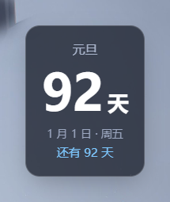
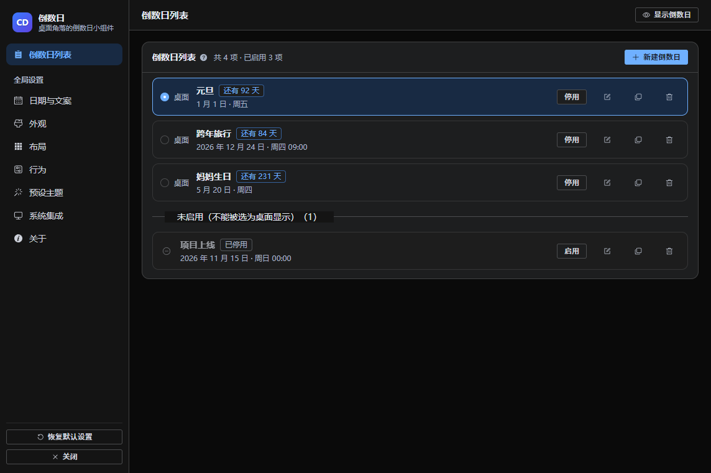
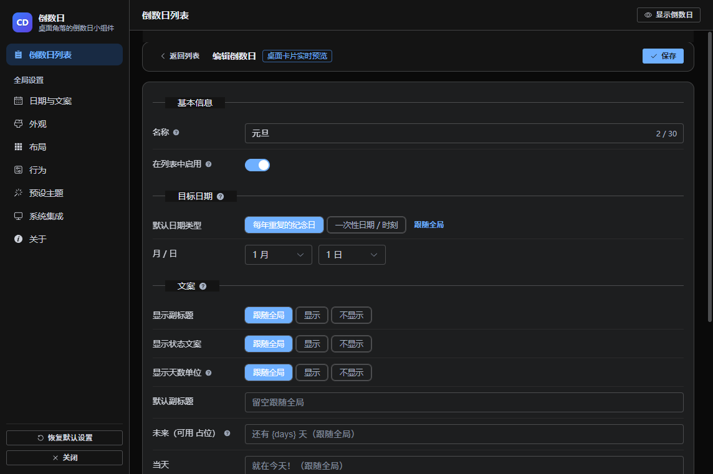
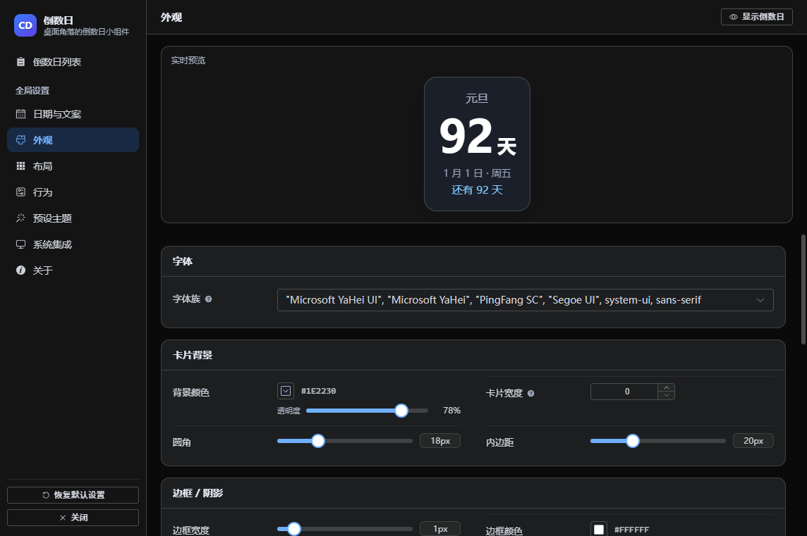
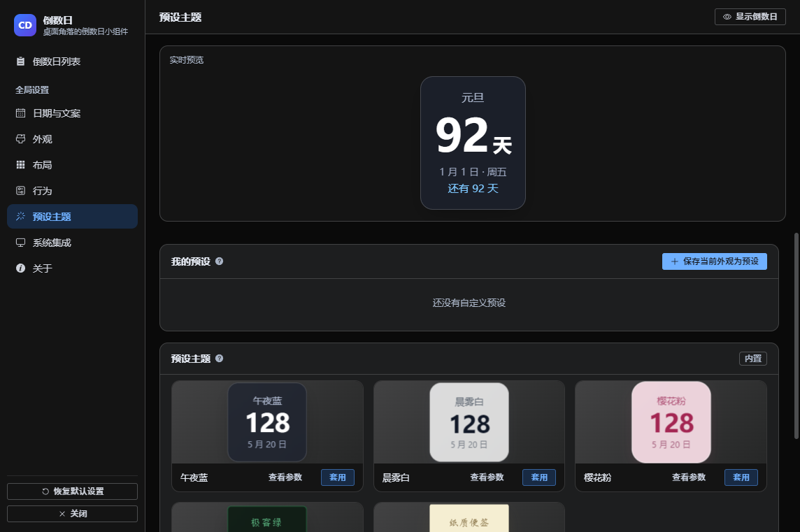

# 倒数日 CountingDown

Windows 桌面角落的倒数日小组件。桌面上是一张外观可以随便调的透明卡片，常驻托盘，设置界面是一个完整的图形界面。



## 能做什么

| 能力 | 说明 |
| --- | --- |
| **多项倒数日** | 列表里想放多少放多少，选其中一项显示在桌面；支持「每年重复的纪念日」与「一次性日期 / 时刻」 |
| **单项独立** | 每项都能单独覆盖背景、字体、四段文字样式；没改的字段继续跟随全局 |
| **预设主题** | 午夜蓝 / 晨雾白 / 樱花粉 / 极客绿 / 纸质便签，一键换肤 |
| **任意位置** | 四角任选，按住卡片就能拖，松手自动吸附到最近的角落 |
| **系统托盘** | 托盘左键显示 / 隐藏，右键出菜单，双击开设置；默认 `ScrollLock` 开关卡片 |
| **中英双语** | 设置界面与托盘菜单可切换 简体中文 / English |

## 快速开始

```bash
pnpm install      # 依赖安装
pnpm dev          # 开发模式（渲染层热更新）
pnpm run dist     # 打包成 NSIS 安装包
```

> 需要 Node 18+ 与 pnpm。装依赖时若报 store 目录不可写，见 [NOTES.md](NOTES.md#依赖安装的坑换机器时可对照排查)。

## 上手三步

### 1. 让卡片出现在桌面上

启动后卡片就在屏幕右上角，同时托盘出现日历图标。

- **托盘左键单击** 或 按 **`ScrollLock`**：显示 / 隐藏卡片
- **托盘右键**：设置、吸附到右上角、总在最前、允许拖动、开机自启、退出
- **托盘双击**：直接打开设置

### 2. 加一项自己的倒数日

设置界面首屏就是倒数日列表。点「新建倒数日」，或者点任意一行进去编辑。



- 每行左侧的单选按钮决定**哪一项显示在桌面**
- 停用的项会归到底部的「未启用」分组，不能被选为桌面显示
- 名称、日期、文案都可以只对这一项生效；**留空就跟随全局**



> **编辑时桌面卡片会实时跟着变**（标题旁有「桌面卡片实时预览」标签）。改的时候不写盘；
> 不满意就点「返回列表 → 放弃修改」，卡片立刻回到编辑前的样子。

### 3. 换个外观

「全局设置 → 外观」里可以调卡片背景色、背景透明度、圆角、内边距、阴影、边框，
以及四段文字（标题 / 大数字 / 副标题 / 状态）各自的字号、颜色、字重、字距、透明度和字体。
**文字透明度和背景透明度互不影响**：前者只让文字变淡，后者只让卡片底色变淡。
「行为」页还能切成 **天 + 时 + 分 + 秒** 实时跳动，时分秒之间的分隔符可以自己选
（默认是「时」「分」这样的中文单位，也能换成冒号或任意符号，每项倒数日还能单独覆盖）。



懒得逐项调就直接套预设主题：



## 全局与单项的关系

- **全局**：默认日期、默认文案、整套外观、显示模式、位置与是否允许拖动、托盘与快捷键。
- **单项**：名称、是否启用，以及**可选的**日期 / 文案 / 外观覆盖 / 时分秒分隔符。留空（或没勾选要覆盖的项）就跟随全局。
- 「预设主题」只改全局外观，已经单独覆盖过外观的项不会被改动（列表里会标出「此项已覆盖外观」）。

## 配置文件

设置由 `electron-store` 保存在 `%APPDATA%\countingdown\config.json`。
设置界面的「系统集成 → 打开配置文件位置」可以直接跳过去；「恢复默认设置」会重置全部配置。
字段结构见 [NOTES.md](NOTES.md#配置文件)。

## 常见问题

**Q：卡片不见了？**<br>
A：托盘图标左键单击切换显示，也可以按快捷键。若位置跑到屏幕外，托盘右键「吸附到右上角」可强制复位。

**Q：设置里改了没生效？**<br>
A：全局设置是即时生效并写盘的。桌面卡片没动的话，先确认它没被隐藏，以及选中那一项没被停用。
注意**编辑子页里的改动是草稿，要点「保存」才生效**。

**Q：怎么让某一项不跟着全局颜色变？**<br>
A：进入该项编辑子页，打开「外观覆盖」总开关，再勾选你想改的那几项。没勾的继续跟随全局。

**Q：快捷键按了没反应？**<br>
A：`ScrollLock` 可能已被别的软件占用。到「系统集成」里重新录制一个组合键（例如 `Ctrl+Alt+D`）。

**Q：任务管理器里怎么显示的是「Electron」？**<br>
A：`pnpm dev` 跑的是 `node_modules` 里的 `electron.exe`，名称来自可执行文件的版本信息，开发模式下改不了
（图标已经是倒数日的）。跑打包版就会显示「倒数日」：`pnpm run dist:dir` 后运行
`release\win-unpacked\CountingDown.exe`。

**Q：`pnpm run icon` 失败？**<br>
A：该脚本依赖 Windows PowerShell 的 `System.Drawing`。失败时托盘会显示空白图标但不影响功能，
也可以手动放一张 16×16 的 PNG 到 `resources/tray.png`。

## 开发

```bash
pnpm run typecheck   # 类型检查（主进程 + 渲染层）
pnpm run build       # 构建到 out/
pnpm run icon        # 重新生成托盘 / 应用图标
```

技术细节、踩过的坑与实测数据都在 [NOTES.md](NOTES.md)：
透明窗口背板、点击穿透、超大字号等比缩放、对比度修正、实时预览的实现方式、
以及 `scripts/` 下可复跑的验证脚本清单。改这几块代码之前建议先扫一眼。
